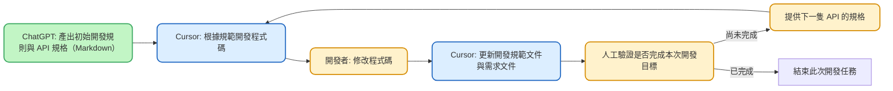
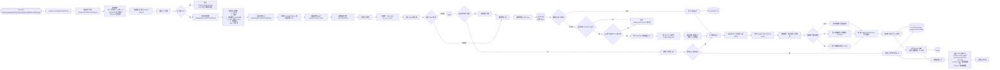
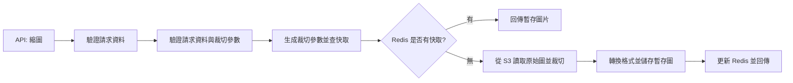
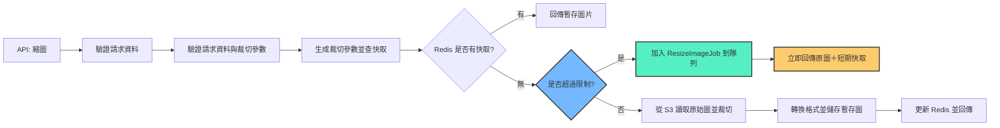

# AI 應用場景分享

需求開發、Pull Request 摘要

---
hideInToc: true
---

# 目錄

<Toc text-sm minDepth="1" maxDepth="3"/>

<style>
  h1 {
    margin-bottom: 2.5rem;
  }
</style>

---
layout: intro
---

# 需求開發應用場景

---
level: 2
---

### 案例一：協助開發 API 與 Rules 演進

1. ChatGPT 產出初始開發規則與 API 規格（Markdown）- `project-rules.md`, `api-spec.md`
  ```
  我要使用 Cursor 來寫 Laravel 的功能，我有 api 規格，還要給哪些文件可以幫助 cursor 更容易了解功能，可以幫我產生一些提示詞嗎？
  ```
2. 在 Cursor 中依據規範開發程式碼
  > 請根據 `project-rules.md` 的規範開發 `api-spec.md` 的 API
3. 人工調整程式碼
4. 在 Cursor 中根據修正內容更新開發規範文件與需求文件
  > 請根據前一個 commit 修改的內容，來優化 `project-rules.md` 與  `api-spec.md` 讓你可以更理解需求進行開發
5. 新增下一隻 API 的需求文件
6. 重複流程直到任務完成

<style>
  h3 {
    margin-bottom: 2.5rem;
  }
</style>

---
hideInToc: true
---

### 流程圖



流程紀錄可參考 [https://github.com/kkday-it/kkday-geo-service/pull/46](https://github.com/kkday-it/kkday-geo-service/pull/46)。

<style>
  h3 {
    margin-bottom: 2.5rem;
  }
</style>

---
hideInToc: true
---

### Laravel 功能開發規格與提示詞 project-rules.md 專案設定

````md magic-move {lines: true}
```md
// 初始設定
## 專案設定
- Laravel 版本：11.x
- 架構風格：Controller + Service + Repository Pattern
- 資料庫：PostgreSQL
- 驗證方式：使用 FormRequest 為主
- 回應格式：皆為 JSON（包含錯誤）
- 錯誤處理：使用 `App\Exceptions\CustomException` 處理統一格式

```

```md
// 5隻API後
## 專案設定
- Laravel 版本：11.x
- 架構風格：Controller + Service + Repository Pattern
- 資料庫：PostgreSQL
- 驗證方式：使用 `App\Http\Requests\BaseRequest` 為基礎的表單驗證
- 回應格式：統一 JSON 格式（包含錯誤）
- 錯誤處理：使用 `App\Exceptions\CustomException` 處理統一格式
- 地理資訊處理：使用 `clickbar/magellan` 套件處理 PostGIS 相關功能
- Controller 命名空間：`App\Http\Controllers`
- Service 命名空間：`App\Services`
- Repository 命名空間：`App\Repositories`
- FormRequest 命名空間：`App\Http\Requests`，各功能子目錄需分類存放
- Parameter 命名空間：`App\Parameters`，各功能子目錄需分類存放
- Resource 命名空間：`App\Http\Resources`，各功能子目錄需分類存放
```

````

<style>
  h3 {
    margin-bottom: 2.5rem;
  }
</style>

---
hideInToc: true
---

### Laravel 功能開發規格與提示詞 project-rules.md 開發任務提示詞

````md magic-move {lines: true}
```md
// 初始設定
## 💡 開發任務提示詞

### 1️⃣ 產生 Controller + Service + Repository
請依據上述 API 規格與資料表，產生對應 Controller，並將邏輯交給 Service 處理，與資料庫相關的邏輯放在 Repository。
請使用依賴注入，並保持乾淨的程式結構。

### 2️⃣ 加入 FormRequest 驗證

```

```md
// 5隻API後
## 💡 開發任務提示詞

### 1️⃣ 產生 Controller + Service + Repository
請依據 API 規格與資料表，產生對應 Controller，並將業務邏輯交給 Service 處理，與資料庫相關的邏輯放在 Repository。

### 2️⃣ Request 使用 App\Http\Requests\BaseRequest 為基礎驗證
- 所有請求類需繼承 `BaseRequest`
- 需實現 `rules()` 方法定義驗證規則
- 需實現 `getParameter()` 方法返回對應的 Parameter 類實例

### 3️⃣ Response 參考 App\Http\Resources 實作
- 所有 Resource 類需繼承 `JsonResource`
- 使用 `MetadataTrait` 處理統一的回應格式
- 實現 `toArray()` 方法轉換資料格式

### 4️⃣ Parameter 類別實作
- 所有 Parameter 類別需實作 `ParameterInterface`
- Parameter 類別命名規則：`{功能名稱}Parameter`
- Parameter 類別需包含對應的 getter 方法
- 在建構函數中接收請求參數並存儲
```

````

<style>
  h3 {
    margin-bottom: 2.5rem;
  }
</style>

---
hideInToc: true
---

### Laravel 功能開發規格與提示詞 project-rules.md 其他注意事項

````md magic-move {lines: true}
```md
// 初始設定
## 🔐 其他注意事項
- 請勿在 Controller 中直接操作 Model，應交由 Service 層處理。
- 所有查詢需考慮效能，避免 N+1。
- 回傳格式需保持統一，錯誤請回傳
{
    "metadata": {
        "status": "9999",
        "desc": "BAD REQUEST: Error message"
    },
    "data": null
}
```

```md
// 5隻API後
## 🔐 其他注意事項
- 請勿在 Controller 中直接操作 Model，應交由 Service 層處理
- 所有查詢需考慮效能，避免 N+1 問題
- 回傳格式需保持統一，包含 metadata 和 data 結構
- 錯誤請使用以下格式回傳:
{
    "metadata": {
        "status": "9999",
        "desc": "BAD REQUEST: Error message"
    },
    "data": null
}
- 使用 `create_date` 和 `modify_date` 作為時間戳記欄位 (在 Model 中定義 CREATED_AT 和 UPDATED_AT 常量)
- 使用 `clickbar/magellan` 套件處理地理資訊，包括 PostGIS 的 ST_Contains 等函數
- 使用 `ramsey/uuid` 生成唯一識別碼 (Hex 格式)
- 所有 API 需加入 KKday Auth 認證
```

````
<style>
  h3 {
    margin-bottom: 2.5rem;
  }
</style>

---
hideInToc: true
layout: two-cols
---
## Cursor Rules generation (0.49.x)

```bash
> /Generate Cursor Rules 
```

- 讀程式碼並自動生成開發規範
- 條件化套用 Rules（指令／分支／路徑匹配）
- 規則可視化管理
- 規則版本控制與擴充

::right::
<div class="flex items-center justify-center h-full">
<SlidevVideo autoplay loop muted controls>
  <source src="https://www.cursor.com/changelog/049/generate-rules.mp4" type="video/mp4" />
</SlidevVideo>
</div>

<style>
  h2 {
    margin-bottom: 2.5rem;
  }
</style>

---
level: 2
---

### 案例二：產生流程圖，確認規格後在進行開發

1. 在 Cursor 上產生既有功能的流程圖

> 使用 Mermaid 語法繪製一個單一 API 的處理流程圖，流程包含：
>	1.	接收外部請求（例如：POST /api/order）
>	2.	驗證與處理輸入資料
>	3.	存取 Redis 快取（標示為 Redis）
>	4.	查詢或寫入資料庫（標示為 Database）
>	5.	對外發送 HTTP 請求（標示為 External API）
>	6.	回傳結果
> 
> 請使用簡潔的節點名稱與箭頭連線，並將 Redis、資料庫、外部 API 等資源標註為不同角色或樣式。
>
> 畫 ImageController@showWithCrop 這隻

<v-click> 
2. 如果覺得不夠細節的話

> 可以在幫我多補充細節嗎
</v-click>

<style>
  h3 {
    margin-bottom: 2.5rem;
  }
</style>

---
hideInToc: true
---




詳細流程圖
https://kkday.atlassian.net/wiki/spaces/KBI/pages/3185641/Image+Flow


---
hideInToc: true
---

### 流程圖(精簡版)

1. 原縮圖流程圖



2. Cursor 更新後的流程圖

> 我現在要在縮圖這隻 API 加上一個機制
>
> 根據流量限制每秒 15 的縮圖請求加上當下 CPU 使用率 70 % 以上時，將縮圖的實際行為改到 Queue 來執行，並回傳原始圖片，CDN cache 時間縮短至 5 分鐘
>
> 請幫我更新流程圖並使用其他顏色標示




3. 使用 Cursor 輔助開發

> 請根據流程圖進行開發

---
layout: intro
---

# MCP (Github MCP Server)

---
level: 2
---

## Cursor 上設定 Github MCP

1. 使用 github MCP [https://github.com/github/github-mcp-server](https://github.com/github/github-mcp-server)
2. 設定方式 Cursor Settings -> MCP -> Add new global MCP server
```json
{
  "mcpServers": {
    "github": {
      "command": "docker",
      "args": [
        "run",
        "-i",
        "--rm",
        "-e",
        "GITHUB_PERSONAL_ACCESS_TOKEN",
        "ghcr.io/github/github-mcp-server"
      ],
      "env": {
        "GITHUB_PERSONAL_ACCESS_TOKEN": "<YOUR_TOKEN>"
      }
    }
  }
}
```

---
level: 3
---

### 申請 github token

1. 申請 access token [New fine-grained personal access token](https://github.com/settings/personal-access-tokens/new)
  - Resource owner: kkday-it
  - Repository access: All repositories
  - Repository permissions
    - Contents: Read
    - Issues: Read & Write
    - Pull requests: Read & Write
2. 在把 token 放為 `<YOUR_TOKEN>`
3. 重開 Cursor

<style>
  h3 {
    margin-bottom: 2.5rem;
  }
</style>

---
level: 2
layout: two-cols
---

## 產生 Pull Request 摘要

- 新增至 Cursor Settings Rules

```
當摘要 Pull Request。摘要需包含： 
1. 主要功能／修正點（條列）  
2. 核心調整
3. 環境配置
4. 改進原理
5. 技術細節
6. 任何潛在風險
7. 外部資源使用情況

```

::right::


使用方式：貼網址在請他產生摘要
> https://github.com/kkday-it/kkday-img-api/pull/288 摘要

```md {*}{maxHeight:'200px'}
我會為您摘要這個 PR。讓我先查看 PR 的詳情。
> Called MCP tool get_pull_request
讓我查看更改的檔案：
> Called MCP tool get_pull_request_files
讓我查看 Enum 部分的變更：
> Called MCP tool get_file_contents
讓我查看 commit 訊息：
> Called MCP tool list_commits
根據拉取的資訊，我為您整理這個 PR 的摘要： 
```

<style>
  h2 {
    margin-bottom: 2.5rem;
  }
</style>

---
hideInToc: true
---

### 摘要範例


```md {*}{maxHeight:'350px'}
# CFN-1506 摘要：以當下資源狀況分配縮圖是否排隊

## 主要功能/修正點
1. 新增系統資源監控機制，自動判斷縮圖請求是同步處理還是排入隊列
2. 實現 SQS 隊列處理系統處理高負載下的縮圖任務
3. 在高負載情況下先返回原圖並設定短期 CDN 快取（5分鐘）
4. 優化系統穩定性，避免高流量場景下資源耗盡

## 核心調整
1. **資源監控機制**：
   - 新增 `CpuUsageHelper` 類監控 CPU 使用率
   - 新增 `ResizeRateLimiter` 類監控每秒請求數 (RPS)
   - 當 CPU 負載和 RPS 同時超過閾值時，將縮圖任務推入隊列

2. **隊列處理系統**：
   - 新增 `ResizeImageJob` 類處理後台縮圖任務
   - 配置 AWS SQS 作為隊列驅動
   - 資源負載高時返回原圖並設定短期 CDN 快取（5分鐘）

3. **系統服務**：
   - 新增 `api-img-resize-queue-sqs.service` 系統服務處理後台縮圖任務
   - 新增啟動和停止腳本以管理服務

## 環境配置
1. **新增環境變數**：
   - `HIGH_LOADING_ENABLE`：是否啟用負載管理（默認 true）
   - `HIGH_LOADING_RPS_THRESHOLD`：每秒請求數閾值（默認 15）
   - `HIGH_LOADING_CPU_THRESHOLD`：CPU 負載閾值（默認 120，單位%）

2. **隊列配置**：
   - 新增 SQS 相關配置（`SQS_AWS_KEY`, `SQS_AWS_SECRET` 等）
   - 配置 `resize-images-sqs` 連接
   - 設定隊列進程記憶體限制（512MB）

## 改進原理
1. **智能判斷**：
   - 縮圖請求先檢查系統負載
   - 負載高時：推入隊列，返回原圖（短期快取）
   - 負載正常時：同步處理縮圖

2. **優化用戶體驗**：
   - 高峰期不會因縮圖處理而導致服務崩潰
   - 用戶看到原圖後，下次訪問時會獲得處理後的縮圖
   - 縮圖處理不干擾主線程，確保系統穩定

## 技術細節
1. 通過 `sys_getloadavg()` 獲取系統負載
2. 使用 APC 緩存存儲單機資源數據（CPU 使用率、核心數），確保每個機器有各自獨立的資源監控
3. 使用 Redis 進行速率限制和縮圖任務避免重複
4. 任務處理失敗時不會重試，以避免資源浪費
5. 採用 Laravel 隊列系統，支持延遲處理和分發
6. 任務唯一性鎖定時間為 10 分鐘，避免重複處理

## 潛在風險
1. SQS 連接失敗可能導致所有縮圖任務直接返回原圖
2. 系統資源監控的閾值設置不合理可能導致過度或不足的任務排隊
3. 已存在的縮圖請求處理流程被修改，可能對現有功能有影響
4. 依賴系統指令（如 `sys_getloadavg()`, `nproc`）獲取 CPU 資訊，在不同環境可能有差異

## 外部資源使用情況
1. **APC 緩存**：
   - 用於縮圖任務資源使用狀態日誌限制（30秒內只記錄一次）
   - 用於緩存單機 CPU 使用率（TTL：10秒）和 CPU 核心數（TTL：1小時）
   - 使用 APC 而非 Redis 是因為 CPU 等系統資源數據是機器特定的，不適合跨機器共享

2. **Redis**：
   - 用於速率限制計數
   - 用於隊列任務去重的唯一鎖（通過 Cache Facade 與 Redis 驅動）

3. **AWS SQS**：
   - 新增 `resize-images-sqs` 隊列連接
   - 用於異步處理縮圖任務
   - 需配置相關環境變數（密鑰、區域、隊列名等）

4. **系統資源**：
   - 監控 CPU 使用率和處理能力
   - 新增 systemd 服務管理隊列處理進程
   - 設定記憶體限制和最大任務處理數
```

<style>
  h3 {
    margin-bottom: 2.5rem;
  }
</style>

---
layout: intro
---

# 其他應用

---
hideInToc: true
---

### 其他應用

- 透過 cursor 生成 commit 訊息，符合 smart commit 格式自動掛上 Work log
  - 設定鍵盤快速鍵: 偏好設定 -> 鍵盤快速鍵 -> `cursor.generateGitCommitMessage`
  - 手動設定 keybindings.json
```json
    {
        "key": "cmd+m",
        "command": "cursor.generateGitCommitMessage"
    },
    {
        "command": "runCommands",
        "key": "cmd+m cmd+m",
        "args": {
            "commands": [
                "git.stageAll",
                "cursor.generateGitCommitMessage",
                "workbench.scm.focus"
            ]
        }
    }
```


<style>
  h3 {
    margin-bottom: 2.5rem;
  }
</style>

---
hideInToc: true
---

### 其他應用

- commit message 會根據你的修改內容來產生
- 可以透過 rules 來調整產生 message 的邏輯
```md
當 generateGitCommitMessage 時
commit 的訊息格式為 <tickect-id>:[<tag>] #time <value>w <value>d <value>h <value>m <comment_string>
ticket-id: 是 CFN-<id>格式，參考 branch 名稱上的單號，如果沒有就放 CFN，不要自動往上加號
tag: feature, fix, docs
 #time <value>w <value>d <value>h <value>m: 是記錄工時的格式 #time 20m 表示 20 分鐘，如果是 0 就不用出現
comment_string: 說明的修改內容，不要出現在 #time 前面
例如: CFN-1486:[fix] #time 20m 訊息來總結此次修改內容
估工時的方式
1. 修改一個檔案
  - 行數大於 100 行算 1h
  - 其他算 20 m
2. 整體工時大於 8h 算 8h
```
<v-clicks>

- 單號常抓錯
- 工時僅供參考，還是要手動調整

</v-clicks>

<style>
  h3 {
    margin-bottom: 2.5rem;
  }
</style>

---
layout: end
hideInToc: true
---

# 謝謝
