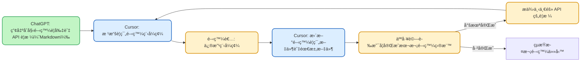
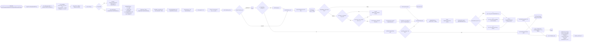
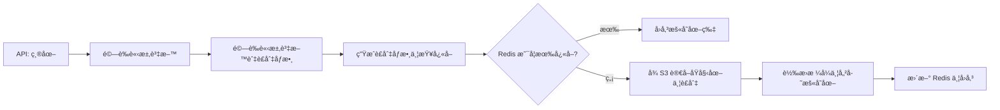
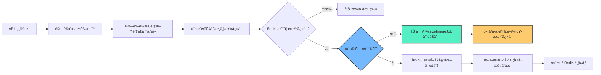

# AI 應用場景分享

需求開發ã€Pull Request 摘è¦

---
hideInToc: true
---

# 目錄

<Toc text-sm minDepth="1" maxDepth="3"/>

<style>
  h1 {
    margin-bottom: 2.5rem;
  }
</style>

---
layout: intro
---

# 需求開發應用場景

---
level: 2
---

### 案例一：å”助開發 API 與 Rules 演進

1. ChatGPT 產出åˆå§‹é–‹ç™¼è¦å‰‡èˆ‡ API è¦æ ¼ï¼ˆMarkdown）- `project-rules.md`, `api-spec.md`
  ```
  我è¦ä½¿ç”¨ Cursor 來寫 Laravel 的功能，我有 api è¦æ ¼ï¼Œé‚„è¦çµ¦å“ªäº›æ–‡ä»¶å¯ä»¥å¹«åŠ© cursor 更容易了解功能，å¯ä»¥å¹«æˆ‘產生一些æ示è©å—？
  ```
2. 在 Cursor 中ä¾æ“šè¦ç¯„開發程å¼ç¢¼
  > 請根據 `project-rules.md` çš„è¦ç¯„開發 `api-spec.md` çš„ API
3. 人工調整程å¼ç¢¼
4. 在 Cursor 中根據修正內容更新開發è¦ç¯„文件與需求文件
  > 請根據å‰ä¸€å€‹ commit 修改的內容，來優化 `project-rules.md` 與  `api-spec.md` 讓你å¯ä»¥æ›´ç†è§£éœ€æ±‚進行開發
5. æ–°å¢ä¸‹ä¸€éš» API 的需求文件
6. é‡è¤‡æµç¨‹ç›´åˆ°ä»»å‹™å®Œæˆ

<style>
  h3 {
    margin-bottom: 2.5rem;
  }
</style>

---
hideInToc: true
---

### æµç¨‹åœ–



æµç¨‹ç´€éŒ„å¯åƒè€ƒ [https://github.com/kkday-it/kkday-geo-service/pull/46](https://github.com/kkday-it/kkday-geo-service/pull/46)。

<style>
  h3 {
    margin-bottom: 2.5rem;
  }
</style>

---
hideInToc: true
---

### Laravel 功能開發è¦æ ¼èˆ‡æç¤ºè© project-rules.md 專案設定

````md magic-move {lines: true}
```md
// åˆå§‹è¨­å®š
## 專案設定
- Laravel 版本：11.x
- æ¶æ§‹é¢¨æ ¼ï¼šController + Service + Repository Pattern
- 資料庫：PostgreSQL
- 驗證方å¼ï¼šä½¿ç”¨ FormRequest 為主
- å›æ‡‰æ ¼å¼ï¼šçš†ç‚º JSON（包å«éŒ¯èª¤ï¼‰
- 錯誤處ç†ï¼šä½¿ç”¨ `App\Exceptions\CustomException` 處ç†çµ±ä¸€æ ¼å¼

```

```md
// 5隻API後
## 專案設定
- Laravel 版本：11.x
- æ¶æ§‹é¢¨æ ¼ï¼šController + Service + Repository Pattern
- 資料庫：PostgreSQL
- 驗證方å¼ï¼šä½¿ç”¨ `App\Http\Requests\BaseRequest` 為基ç¤çš„表單驗證
- å›æ‡‰æ ¼å¼ï¼šçµ±ä¸€ JSON æ ¼å¼ï¼ˆåŒ…å«éŒ¯èª¤ï¼‰
- 錯誤處ç†ï¼šä½¿ç”¨ `App\Exceptions\CustomException` 處ç†çµ±ä¸€æ ¼å¼
- 地ç†è³‡è¨Šè™•ç†ï¼šä½¿ç”¨ `clickbar/magellan` å¥—ä»¶è™•ç† PostGIS 相關功能
- Controller 命å空間：`App\Http\Controllers`
- Service 命å空間：`App\Services`
- Repository 命å空間：`App\Repositories`
- FormRequest 命å空間：`App\Http\Requests`，å„功能å­ç›®éŒ„需分é¡å­˜æ”¾
- Parameter 命å空間：`App\Parameters`，å„功能å­ç›®éŒ„需分é¡å­˜æ”¾
- Resource 命å空間：`App\Http\Resources`，å„功能å­ç›®éŒ„需分é¡å­˜æ”¾
```

````

<style>
  h3 {
    margin-bottom: 2.5rem;
  }
</style>

---
hideInToc: true
---

### Laravel 功能開發è¦æ ¼èˆ‡æç¤ºè© project-rules.md 開發任務æ示è©

````md magic-move {lines: true}
```md
// åˆå§‹è¨­å®š
## 💡 開發任務æ示è©

### 1ï¸âƒ£ 產生 Controller + Service + Repository
è«‹ä¾æ“šä¸Šè¿° API è¦æ ¼èˆ‡è³‡æ–™è¡¨ï¼Œç”¢ç”Ÿå°æ‡‰ Controller，並將é‚輯交給 Service 處ç†ï¼Œèˆ‡è³‡æ–™åº«ç›¸é—œçš„é‚輯放在 Repository。
請使用ä¾è³´æ³¨å…¥ï¼Œä¸¦ä¿æŒä¹¾æ·¨çš„程å¼çµæ§‹ã€‚

### 2ï¸âƒ£ 加入 FormRequest é©—è­‰

```

```md
// 5隻API後
## 💡 開發任務æ示è©

### 1ï¸âƒ£ 產生 Controller + Service + Repository
è«‹ä¾æ“š API è¦æ ¼èˆ‡è³‡æ–™è¡¨ï¼Œç”¢ç”Ÿå°æ‡‰ Controller，並將業務é‚輯交給 Service 處ç†ï¼Œèˆ‡è³‡æ–™åº«ç›¸é—œçš„é‚輯放在 Repository。

### 2ï¸âƒ£ Request 使用 App\Http\Requests\BaseRequest 為基ç¤é©—è­‰
- 所有請求é¡éœ€ç¹¼æ‰¿ `BaseRequest`
- éœ€å¯¦ç¾ `rules()` 方法定義驗證è¦å‰‡
- éœ€å¯¦ç¾ `getParameter()` 方法返å›å°æ‡‰çš„ Parameter é¡å¯¦ä¾‹

### 3ï¸âƒ£ Response åƒè€ƒ App\Http\Resources 實作
- 所有 Resource é¡éœ€ç¹¼æ‰¿ `JsonResource`
- 使用 `MetadataTrait` 處ç†çµ±ä¸€çš„å›æ‡‰æ ¼å¼
- å¯¦ç¾ `toArray()` 方法轉æ›è³‡æ–™æ ¼å¼

### 4ï¸âƒ£ Parameter é¡åˆ¥å¯¦ä½œ
- 所有 Parameter é¡åˆ¥éœ€å¯¦ä½œ `ParameterInterface`
- Parameter é¡åˆ¥å‘½åè¦å‰‡ï¼š`{功能å稱}Parameter`
- Parameter é¡åˆ¥éœ€åŒ…å«å°æ‡‰çš„ getter 方法
- 在建構函數中æ¥æ”¶è«‹æ±‚åƒæ•¸ä¸¦å­˜å„²
```

````

<style>
  h3 {
    margin-bottom: 2.5rem;
  }
</style>

---
hideInToc: true
---

### Laravel 功能開發è¦æ ¼èˆ‡æç¤ºè© project-rules.md 其他注æ„事項

````md magic-move {lines: true}
```md
// åˆå§‹è¨­å®š
## 🔠其他注æ„事項
- 請勿在 Controller 中直æ¥æ“作 Model，應交由 Service 層處ç†ã€‚
- 所有查詢需考慮效能，é¿å… N+1。
- å›å‚³æ ¼å¼éœ€ä¿æŒçµ±ä¸€ï¼ŒéŒ¯èª¤è«‹å›å‚³
{
    "metadata": {
        "status": "9999",
        "desc": "BAD REQUEST: Error message"
    },
    "data": null
}
```

```md
// 5隻API後
## 🔠其他注æ„事項
- 請勿在 Controller 中直æ¥æ“作 Model，應交由 Service 層處ç†
- 所有查詢需考慮效能，é¿å… N+1 å•é¡Œ
- å›å‚³æ ¼å¼éœ€ä¿æŒçµ±ä¸€ï¼ŒåŒ…å« metadata å’Œ data çµæ§‹
- 錯誤請使用以下格å¼å›å‚³:
{
    "metadata": {
        "status": "9999",
        "desc": "BAD REQUEST: Error message"
    },
    "data": null
}
- 使用 `create_date` å’Œ `modify_date` ä½œç‚ºæ™‚é–“æˆ³è¨˜æ¬„ä½ (在 Model 中定義 CREATED_AT å’Œ UPDATED_AT 常é‡)
- 使用 `clickbar/magellan` 套件處ç†åœ°ç†è³‡è¨Šï¼ŒåŒ…括 PostGIS çš„ ST_Contains 等函數
- 使用 `ramsey/uuid` 生æˆå”¯ä¸€è­˜åˆ¥ç¢¼ (Hex æ ¼å¼)
- 所有 API 需加入 KKday Auth èªè­‰
```

````
<style>
  h3 {
    margin-bottom: 2.5rem;
  }
</style>

---
hideInToc: true
layout: two-cols
---
## Cursor Rules generation (0.49.x)

```bash
> /Generate Cursor Rules 
```

- 讀程å¼ç¢¼ä¸¦è‡ªå‹•ç”Ÿæˆé–‹ç™¼è¦ç¯„
- æ¢ä»¶åŒ–套用 Rules（指令ï¼åˆ†æ”¯ï¼è·¯å¾‘匹é…）
- è¦å‰‡å¯è¦–化管ç†
- è¦å‰‡ç‰ˆæœ¬æ§åˆ¶èˆ‡æ“´å……

::right::
<div class="flex items-center justify-center h-full">
<SlidevVideo autoplay loop muted controls>
  <source src="https://www.cursor.com/changelog/049/generate-rules.mp4" type="video/mp4" />
</SlidevVideo>
</div>

<style>
  h2 {
    margin-bottom: 2.5rem;
  }
</style>

---
level: 2
---

### 案例二：產生æµç¨‹åœ–，確èªè¦æ ¼å¾Œåœ¨é€²è¡Œé–‹ç™¼

1. 在 Cursor 上產生既有功能的æµç¨‹åœ–

> 使用 Mermaid èªæ³•ç¹ªè£½ä¸€å€‹å–®ä¸€ API 的處ç†æµç¨‹åœ–，æµç¨‹åŒ…å«ï¼š
>	1.	æ¥æ”¶å¤–部請求（例如：POST /api/order）
>	2.	驗證與處ç†è¼¸å…¥è³‡æ–™
>	3.	å­˜å– Redis å¿«å–（標示為 Redis）
>	4.	查詢或寫入資料庫（標示為 Database）
>	5.	å°å¤–ç™¼é€ HTTP 請求（標示為 External API）
>	6.	å›å‚³çµæœ
> 
> 請使用簡潔的節é»å稱與箭頭連線，並將 Redisã€è³‡æ–™åº«ã€å¤–部 API 等資æºæ¨™è¨»ç‚ºä¸åŒè§’色或樣å¼ã€‚
>
> 畫 ImageController@showWithCrop 這隻

<v-click> 
2. 如æœè¦ºå¾—ä¸å¤ ç´°ç¯€çš„話

> å¯ä»¥åœ¨å¹«æˆ‘多補充細節å—
</v-click>

<style>
  h3 {
    margin-bottom: 2.5rem;
  }
</style>

---
hideInToc: true
---




詳細æµç¨‹åœ–
https://kkday.atlassian.net/wiki/spaces/KBI/pages/3185641/Image+Flow


---
hideInToc: true
---

### æµç¨‹åœ–(精簡版)

1. åŸç¸®åœ–æµç¨‹åœ–



2. Cursor 更新後的æµç¨‹åœ–

> 我ç¾åœ¨è¦åœ¨ç¸®åœ–這隻 API 加上一個機制
>
> 根據æµé‡é™åˆ¶æ¯ç§’ 15 的縮圖請求加上當下 CPU ä½¿ç”¨ç‡ 70 % 以上時，將縮圖的實際行為改到 Queue 來執行，並å›å‚³åŸå§‹åœ–片，CDN cache 時間縮短至 5 分é˜
>
> 請幫我更新æµç¨‹åœ–並使用其他é¡è‰²æ¨™ç¤º




3. 使用 Cursor 輔助開發

> 請根據æµç¨‹åœ–進行開發

---
layout: intro
---

# MCP (Github MCP Server)

---
level: 2
---

## Cursor 上設定 Github MCP

1. 使用 github MCP [https://github.com/github/github-mcp-server](https://github.com/github/github-mcp-server)
2. è¨­å®šæ–¹å¼ Cursor Settings -> MCP -> Add new global MCP server
```json
{
  "mcpServers": {
    "github": {
      "command": "docker",
      "args": [
        "run",
        "-i",
        "--rm",
        "-e",
        "GITHUB_PERSONAL_ACCESS_TOKEN",
        "ghcr.io/github/github-mcp-server"
      ],
      "env": {
        "GITHUB_PERSONAL_ACCESS_TOKEN": "<YOUR_TOKEN>"
      }
    }
  }
}
```

---
level: 3
---

### 申請 github token

1. 申請 access token [New fine-grained personal access token](https://github.com/settings/personal-access-tokens/new)
  - Resource owner: kkday-it
  - Repository access: All repositories
  - Repository permissions
    - Contents: Read
    - Issues: Read & Write
    - Pull requests: Read & Write
2. 在把 token 放為 `<YOUR_TOKEN>`
3. é‡é–‹ Cursor

<style>
  h3 {
    margin-bottom: 2.5rem;
  }
</style>

---
level: 2
layout: two-cols
---

## 產生 Pull Request 摘è¦

- æ–°å¢è‡³ Cursor Settings Rules

```
ç•¶æ‘˜è¦ Pull Request。摘è¦éœ€åŒ…å«ï¼š 
1. 主è¦åŠŸèƒ½ï¼ä¿®æ­£é»ï¼ˆæ¢åˆ—）  
2. 核心調整
3. 環境é…ç½®
4. 改進åŸç†
5. 技術細節
6. 任何潛在風險
7. 外部資æºä½¿ç”¨æƒ…æ³

```

::right::


使用方å¼ï¼šè²¼ç¶²å€åœ¨è«‹ä»–產生摘è¦
> https://github.com/kkday-it/kkday-img-api/pull/288 摘è¦

```md {*}{maxHeight:'200px'}
我會為您摘è¦é€™å€‹ PR。讓我先查看 PR 的詳情。
> Called MCP tool get_pull_request
讓我查看更改的檔案：
> Called MCP tool get_pull_request_files
讓我查看 Enum 部分的變更：
> Called MCP tool get_file_contents
讓我查看 commit 訊æ¯ï¼š
> Called MCP tool list_commits
根據拉å–的資訊，我為您整ç†é€™å€‹ PR 的摘è¦ï¼š 
```

<style>
  h2 {
    margin-bottom: 2.5rem;
  }
</style>

---
hideInToc: true
---

### 摘è¦ç¯„例


```md {*}{maxHeight:'350px'}
# CFN-1506 摘è¦ï¼šä»¥ç•¶ä¸‹è³‡æºç‹€æ³åˆ†é…縮圖是å¦æ’隊

## 主è¦åŠŸèƒ½/修正é»
1. æ–°å¢ç³»çµ±è³‡æºç›£æ§æ©Ÿåˆ¶ï¼Œè‡ªå‹•åˆ¤æ–·ç¸®åœ–請求是åŒæ­¥è™•ç†é‚„是æ’入隊列
2. å¯¦ç¾ SQS 隊列處ç†ç³»çµ±è™•ç†é«˜è² è¼‰ä¸‹çš„縮圖任務
3. 在高負載情æ³ä¸‹å…ˆè¿”å›åŸåœ–並設定短期 CDN å¿«å–（5分é˜ï¼‰
4. 優化系統穩定性，é¿å…高æµé‡å ´æ™¯ä¸‹è³‡æºè€—盡

## 核心調整
1. **資æºç›£æ§æ©Ÿåˆ¶**：
   - æ–°å¢ `CpuUsageHelper` é¡ç›£æ§ CPU 使用ç‡
   - æ–°å¢ `ResizeRateLimiter` é¡ç›£æ§æ¯ç§’請求數 (RPS)
   - 當 CPU 負載和 RPS åŒæ™‚超é閾值時，將縮圖任務æ¨å…¥éšŠåˆ—

2. **隊列處ç†ç³»çµ±**：
   - æ–°å¢ `ResizeImageJob` é¡è™•ç†å¾Œå°ç¸®åœ–任務
   - é…ç½® AWS SQS 作為隊列驅動
   - 資æºè² è¼‰é«˜æ™‚è¿”å›åŸåœ–並設定短期 CDN å¿«å–（5分é˜ï¼‰

3. **系統æœå‹™**：
   - æ–°å¢ `api-img-resize-queue-sqs.service` 系統æœå‹™è™•ç†å¾Œå°ç¸®åœ–任務
   - æ–°å¢å•Ÿå‹•å’Œåœæ­¢è…³æœ¬ä»¥ç®¡ç†æœå‹™

## 環境é…ç½®
1. **æ–°å¢ç’°å¢ƒè®Šæ•¸**：
   - `HIGH_LOADING_ENABLE`：是å¦å•Ÿç”¨è² è¼‰ç®¡ç†ï¼ˆé»˜èª true）
   - `HIGH_LOADING_RPS_THRESHOLD`：æ¯ç§’è«‹æ±‚æ•¸é–¾å€¼ï¼ˆé»˜èª 15）
   - `HIGH_LOADING_CPU_THRESHOLD`：CPU è² è¼‰é–¾å€¼ï¼ˆé»˜èª 120，單ä½%）

2. **隊列é…ç½®**：
   - æ–°å¢ SQS 相關é…置（`SQS_AWS_KEY`, `SQS_AWS_SECRET` 等）
   - é…ç½® `resize-images-sqs` 連æ¥
   - 設定隊列進程記憶體é™åˆ¶ï¼ˆ512MB）

## 改進åŸç†
1. **智能判斷**：
   - 縮圖請求先檢查系統負載
   - 負載高時：æ¨å…¥éšŠåˆ—，返å›åŸåœ–（短期快å–）
   - 負載正常時：åŒæ­¥è™•ç†ç¸®åœ–

2. **優化用戶體驗**：
   - 高峰期ä¸æœƒå› ç¸®åœ–處ç†è€Œå°è‡´æœå‹™å´©æ½°
   - 用戶看到åŸåœ–後，下次訪å•æ™‚會ç²å¾—處ç†å¾Œçš„縮圖
   - 縮圖處ç†ä¸å¹²æ“¾ä¸»ç·šç¨‹ï¼Œç¢ºä¿ç³»çµ±ç©©å®š

## 技術細節
1. 通é `sys_getloadavg()` ç²å–系統負載
2. 使用 APC 緩存存儲單機資æºæ•¸æ“šï¼ˆCPU 使用ç‡ã€æ ¸å¿ƒæ•¸ï¼‰ï¼Œç¢ºä¿æ¯å€‹æ©Ÿå™¨æœ‰å„自ç¨ç«‹çš„資æºç›£æ§
3. 使用 Redis 進行速ç‡é™åˆ¶å’Œç¸®åœ–任務é¿å…é‡è¤‡
4. 任務處ç†å¤±æ•—時ä¸æœƒé‡è©¦ï¼Œä»¥é¿å…資æºæµªè²»
5. æ¡ç”¨ Laravel 隊列系統，支æŒå»¶é²è™•ç†å’Œåˆ†ç™¼
6. 任務唯一性é–定時間為 10 分é˜ï¼Œé¿å…é‡è¤‡è™•ç†

## 潛在風險
1. SQS 連æ¥å¤±æ•—å¯èƒ½å°è‡´æ‰€æœ‰ç¸®åœ–任務直æ¥è¿”å›åŸåœ–
2. 系統資æºç›£æ§çš„閾值設置ä¸åˆç†å¯èƒ½å°è‡´é度或ä¸è¶³çš„任務æ’隊
3. 已存在的縮圖請求處ç†æµç¨‹è¢«ä¿®æ”¹ï¼Œå¯èƒ½å°ç¾æœ‰åŠŸèƒ½æœ‰å½±éŸ¿
4. ä¾è³´ç³»çµ±æŒ‡ä»¤ï¼ˆå¦‚ `sys_getloadavg()`, `nproc`）ç²å– CPU 資訊，在ä¸åŒç’°å¢ƒå¯èƒ½æœ‰å·®ç•°

## 外部資æºä½¿ç”¨æƒ…æ³
1. **APC 緩存**：
   - 用於縮圖任務資æºä½¿ç”¨ç‹€æ…‹æ—¥èªŒé™åˆ¶ï¼ˆ30秒內åªè¨˜éŒ„一次）
   - 用於緩存單機 CPU 使用ç‡ï¼ˆTTL：10秒）和 CPU 核心數（TTL：1å°æ™‚）
   - 使用 APC 而é Redis 是因為 CPU 等系統資æºæ•¸æ“šæ˜¯æ©Ÿå™¨ç‰¹å®šçš„，ä¸é©åˆè·¨æ©Ÿå™¨å…±äº«

2. **Redis**：
   - 用於速ç‡é™åˆ¶è¨ˆæ•¸
   - 用於隊列任務å»é‡çš„唯一é–（通é Cache Facade 與 Redis 驅動）

3. **AWS SQS**：
   - æ–°å¢ `resize-images-sqs` 隊列連æ¥
   - 用於異步處ç†ç¸®åœ–任務
   - 需é…置相關環境變數（密鑰ã€å€åŸŸã€éšŠåˆ—å等）

4. **系統資æº**：
   - ç›£æ§ CPU 使用ç‡å’Œè™•ç†èƒ½åŠ›
   - æ–°å¢ systemd æœå‹™ç®¡ç†éšŠåˆ—處ç†é€²ç¨‹
   - 設定記憶體é™åˆ¶å’Œæœ€å¤§ä»»å‹™è™•ç†æ•¸
```

<style>
  h3 {
    margin-bottom: 2.5rem;
  }
</style>

---
layout: intro
---

# 其他應用

---
hideInToc: true
---

### 其他應用

- é€é cursor ç”Ÿæˆ commit 訊æ¯ï¼Œç¬¦åˆ smart commit æ ¼å¼è‡ªå‹•æ›ä¸Š Work log
  - 設定éµç›¤å¿«é€Ÿéµ: å好設定 -> éµç›¤å¿«é€Ÿéµ -> `cursor.generateGitCommitMessage`
  - 手動設定 keybindings.json
```json
    {
        "key": "cmd+m",
        "command": "cursor.generateGitCommitMessage"
    },
    {
        "command": "runCommands",
        "key": "cmd+m cmd+m",
        "args": {
            "commands": [
                "git.stageAll",
                "cursor.generateGitCommitMessage",
                "workbench.scm.focus"
            ]
        }
    }
```


<style>
  h3 {
    margin-bottom: 2.5rem;
  }
</style>

---
hideInToc: true
---

### 其他應用

- commit message 會根據你的修改內容來產生
- å¯ä»¥é€é rules 來調整產生 message çš„é‚輯
```md
當 generateGitCommitMessage 時
commit 的訊æ¯æ ¼å¼ç‚º <tickect-id>:[<tag>] #time <value>w <value>d <value>h <value>m <comment_string>
ticket-id: 是 CFN-<id>æ ¼å¼ï¼Œåƒè€ƒ branch å稱上的單號，如æœæ²’有就放 CFN，ä¸è¦è‡ªå‹•å¾€ä¸ŠåŠ è™Ÿ
tag: feature, fix, docs
 #time <value>w <value>d <value>h <value>m: æ˜¯è¨˜éŒ„å·¥æ™‚çš„æ ¼å¼ #time 20m 表示 20 分é˜ï¼Œå¦‚æœæ˜¯ 0 å°±ä¸ç”¨å‡ºç¾
comment_string: 說æ˜çš„修改內容，ä¸è¦å‡ºç¾åœ¨ #time å‰é¢
例如: CFN-1486:[fix] #time 20m 訊æ¯ä¾†ç¸½çµæ­¤æ¬¡ä¿®æ”¹å…§å®¹
估工時的方å¼
1. 修改一個檔案
  - 行數大於 100 行算 1h
  - 其他算 20 m
2. 整體工時大於 8h 算 8h
```
<v-clicks>

- 單號常抓錯
- 工時僅供åƒè€ƒï¼Œé‚„是è¦æ‰‹å‹•èª¿æ•´

</v-clicks>

<style>
  h3 {
    margin-bottom: 2.5rem;
  }
</style>

---
layout: end
hideInToc: true
---

# è¬è¬
